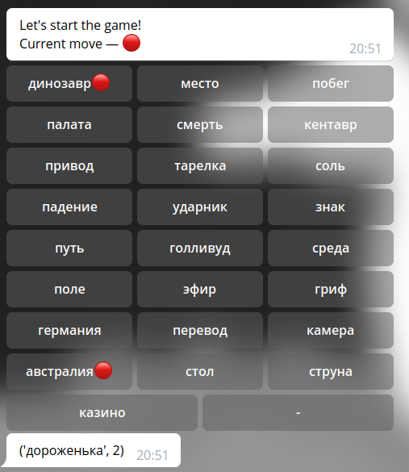

# Python telegram bot playing codenames



# Installation

```
pip3 install -r requirements.txt
wget https://rusvectores.org/static/models/rusvectores4/RNC/ruscorpora_upos_skipgram_300_5_2018.vec.gz
gunzip ruscorpora_upos_skipgram_300_5_2018.vec.gz
mv ruscorpora_upos_skipgram_300_5_2018.vec model.txt
python3 parser.py
python3 Tgbot.py
```

Bot can play 1 or 2 teams game, and do both guessing and making hints. The technology I used was Word2Vec & python-telegram-bot.

Also you need file `secret_data`, where you place config:

```
{
    ...
    "token": "YOUR_TELEGRAM_TOKEN"
}
```

# Examples

```
('фараон', 2)
королева египет 
```

```
('бюллетеень', 1)
урна
```

```
('костюм', 2)
наряд рубашка 
```

```
('табурет', 3)
стул лейка карлик 
```